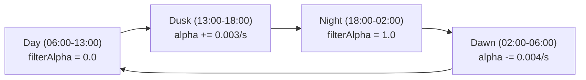
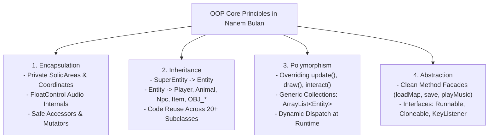
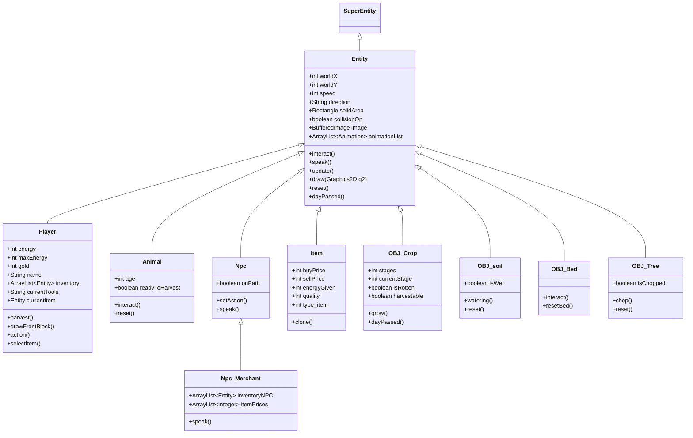
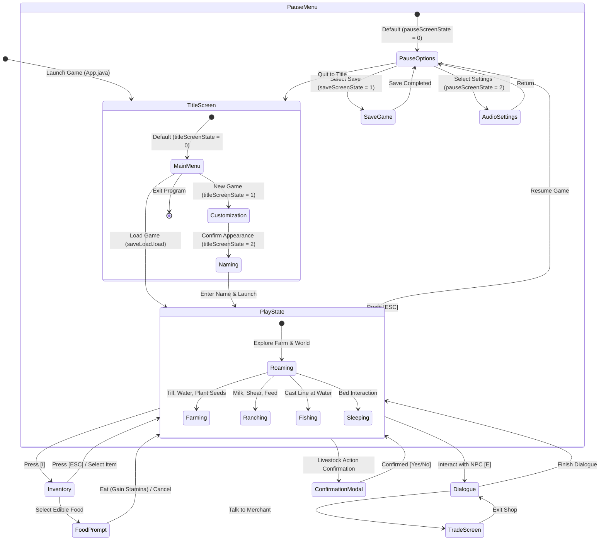
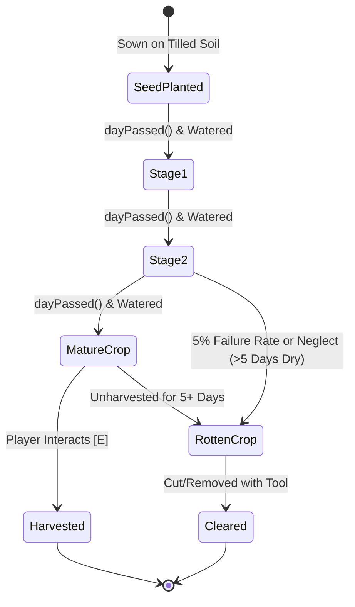

# 🌾 Nanem Bulan (Harvest Moon 2D Simulation Engine)

[](https://github.com/fed242002/PBOPROJECT_HarvestMoon)
[](https://www.oracle.com/java/)
[](https://docs.oracle.com/javase/8/docs/technotes/guides/swing/)
[](#-object-oriented-programming-oop-architecture)
[](#-game-loop--rendering-pipeline-under-the-hood)
[](#-credits--course-information)

> **Course:** Pemrograman Berorientasi Objek (PBO) / Object-Oriented Programming — Semester 2 Project  
- **Authors / Developers:**  [@fertan15](https://github.com/fertan15), [@fed242002](https://github.com/fed242002)
  
> **Repository:** [fed242002/PBOPROJECT_HarvestMoon](https://github.com/fed242002/PBOPROJECT_HarvestMoon)  
> **Game Window Title:** `"nanem Bulan"`

---

## 📋 Table of Contents
1. [Executive Overview & Game Lore](#-executive-overview--game-lore)
2. [Game Loop & Rendering Pipeline Under the Hood](#-game-loop--rendering-pipeline-under-the-hood)
   - [Delta Timing & Fixed 60 FPS Loop](#delta-timing--fixed-60-fps-loop)
   - [Layered Render Pipeline & Y-Depth Sorting](#layered-render-pipeline--y-depth-sorting)
   - [Camera Viewport Culling](#camera-viewport-culling)
3. [Deep Dive into Core Game Systems](#-deep-dive-into-core-game-systems)
   - [1. Agriculture & Crop Lifecycle Engine](#1-agriculture--crop-lifecycle-engine)
   - [2. Livestock Ranching & Husbandry](#2-livestock-ranching--husbandry)
   - [3. Fishing Mini-Game & Weighted Loot System](#3-fishing-mini-game--weighted-loot-system)
   - [4. Dynamic Calendar & Time Engine](#4-dynamic-calendar--time-engine)
   - [5. Atmospheric Lighting & Diurnal Day/Night Cycle](#5-atmospheric-lighting--diurnal-daynight-cycle)
   - [6. Multi-Layer Modular Character Customization](#6-multi-layer-modular-character-customization)
   - [7. Dialogue System & Commercial Economy](#7-dialogue-system--commercial-economy)
   - [8. Energy & Stamina Consumption Engine](#8-energy--stamina-consumption-engine)
   - [9. A* (A-Star) AI Pathfinding System](#9-a-a-star-ai-pathfinding-system)
   - [10. Collision Detection & Event Warping](#10-collision-detection--event-warping)
   - [11. Multi-Track Audio & Volume Control Engine](#11-multi-track-audio--volume-control-engine)
   - [12. Binary Data Persistence (Save & Load)](#12-binary-data-persistence-save--load)
4. [Object-Oriented Programming (OOP) Architecture](#-object-oriented-programming-oop-architecture)
   - [The Four Pillars of OOP in Nanem Bulan](#the-four-pillars-of-oop-in-nanem-bulan)
   - [SOLID Principles Compliance](#solid-principles-compliance)
   - [Design Patterns Implemented](#design-patterns-implemented)
5. [System Architecture & UML Diagrams](#-system-architecture--uml-diagrams)
   - [Class Hierarchy Diagram](#class-hierarchy-diagram)
   - [Game State Machine Diagram](#game-state-machine-diagram)
   - [Crop Lifecycle State Diagram](#crop-lifecycle-state-diagram)
6. [Complete Package & Class Reference Matrix](#-complete-package--class-reference-matrix)
7. [Comprehensive Item & Economy Catalog](#-comprehensive-item--economy-catalog)
   - [Tools & Equipment](#tools--equipment)
   - [Seeds (Quality Tiers 1, 2, 3) & Crop Yields](#seeds-quality-tiers-1-2-3--crop-yields)
   - [Livestock & Animal Products](#livestock--animal-products)
   - [Edibles & Energy Replenishment](#edibles--energy-replenishment)
   - [Materials & Miscellaneous](#materials--miscellaneous)
8. [World Maps, Environments & Navigation](#-world-maps-environments--navigation)
9. [Controls, Keybindings & Debug Tools](#-controls-keybindings--debug-tools)
10. [Installation, Compilation & Execution Guide](#-installation-compilation--execution-guide)
11. [Troubleshooting & Frequently Asked Questions](#-troubleshooting--frequently-asked-questions)
12. [Future Roadmap & Project Credits](#-future-roadmap--project-credits)

---

## 🌟 Executive Overview & Game Lore

### The Vision
**Nanem Bulan** (*Indonesian: "Planting the Moon"*) is a top-down, tile-based 2D farming, ranching, and community life simulation engine engineered in **pure Java Standard Edition (Java SE)** utilizing native **Java Swing** and **Java AWT** graphics pipelines. 

Conceived and constructed from the ground up for the university **Object-Oriented Programming (Pemrograman Berorientasi Objek - PBO)** curriculum, the project rejects black-box game engines (such as Unity, Godot, or LibGDX). Instead, it implements a bespoke software engineering foundation comprising custom delta-time thread timing, 2.5D depth buffer ordering, sub-tile spatial bounding box collision algorithms, graph-based A\* pathfinding, multi-layer sprite composition, radial lighting math, and binary serialization.

### The World & Lore
Set in the mystical lunar valley of *Nanem Bulan*, the player steps into the shoes of a young farmer inheriting a homestead nestled between whispering forests, bustling town squares, and deep fishing waters. Time in the valley is governed by celestial alignments:
- Four seasonal epochs: **Moonlit**, **Sunlit**, **Frostbloom**, and **Amberfall**.
- Seven distinct celestial days: **Moon's Dawn**, **Sun's Rise**, **Frostday**, **Bloomrest**, **Amberlight**, **Fallenday**, and **Eclipsend**.
- Farmers balance energy against time—tilling earth, irrigating crops, caring for exotic sheep and dairy cows, catching prize lake fish, and trading goods with eccentric village merchants.

---

## ⚙️ Game Loop & Rendering Pipeline Under the Hood

The entire game engine is driven by [`GamePanel.java`](src/Main/GamePanel.java), which extends `javax.swing.JPanel` and implements `java.lang.Runnable`.

```mermaid
graph LR
    subgraph "Thread Execution Cycle (60 Hz)"
        A[Calculate Nano Delta] --> B{Delta >= 1.0?}
        B -- Yes --> C[update()]
        C --> D[repaint()]
        D --> E[delta--]
        E --> B
        B -- No --> F[Sleep / Yield]
        F --> A
    end
```

### Delta Timing & Fixed 60 FPS Loop
Rather than using a simple `Thread.sleep(16)` which suffers from OS thread scheduling drift, Nanem Bulan uses a high-precision **delta accumulator fixed-timestep game loop** operating on `System.nanoTime()`:

$$\text{DrawInterval} = \frac{1\,000\,000\,000\text{ ns}}{60\text{ FPS}} \approx 16\,666\,666.67\text{ ns}$$

```java
// Snippet from GamePanel.java
double drawInterval = 1000000000 / FPS; // 60 FPS in nanoseconds
double delta = 0;
long lastTime = System.nanoTime();
long currentTime;

while (gameThread != null) {
    currentTime = System.nanoTime();
    delta += (currentTime - lastTime) / drawInterval;
    lastTime = currentTime;

    if (delta >= 1) {
        update();   // Discrete physics, collisions, inputs, timers
        repaint();  // Trigger paintComponent(Graphics g)
        delta--;
    }
}
```

### Layered Render Pipeline & Y-Depth Sorting
Rendering order is crucial in 2.5D isometric/top-down perspective. Without proper sorting, entities appear to float behind or clip awkwardly through trees and buildings.

Inside `paintComponent(Graphics g)` in [`GamePanel.java`](src/Main/GamePanel.java), rendering executes in a strict 8-step pipeline:

1. **Background Terrain Tiles:** Rendered via [`TileManager.java`](src/tile/TileManager.java) with viewport clipping.
2. **Agricultural Soil Layer:** Tilled dirt and wet soil tiles ([`OBJ_soil.java`](src/object/OBJ_soil.java)) rendered from `farmObj`.
3. **Crops Layer:** Growing plants ([`OBJ_Crop.java`](src/object/OBJ_Crop.java)) rendered from `cropObj`.
4. **Entity Dynamic Gathering:** Populates an ephemeral list `entityList` containing:
   - Player character ([`Player.java`](src/entity/Player.java))
   - NPCs and Animals ([`Npc.java`](src/entity/Npc.java), [`Animal.java`](src/entity/Animal.java))
   - Static environmental props ([`OBJ_Tree.java`](src/object/OBJ_Tree.java), [`OBJ_Bed.java`](src/object/OBJ_Bed.java), etc.)
5. **Y-Depth Sorting (Depth Buffering):** All active entities are dynamically sorted based on their bottom-most boundary coordinate using a custom comparator:
   $$\text{DepthKey} = \text{worldY} + \text{solidArea.y} + \text{solidArea.height}$$
   ```java
   Collections.sort(entityList, new Comparator<Entity>() {
       @Override
       public int compare(Entity e1, Entity e2) {
           int e1Bottom = e1.worldY + e1.solidArea.y + e1.solidArea.height;
           int e2Bottom = e2.worldY + e2.solidArea.y + e2.solidArea.height;
           return Integer.compare(e1Bottom, e2Bottom);
       }
   });
   ```
6. **Polymorphic Entity Draw Calls:** Iterates over sorted `entityList`, invoking `entity.draw(g2)`.
7. **Atmospheric Environment Layer:** Renders the nocturnal darkness mask and lantern falloff via [`EnvironmentManager.java`](src/Environment/EnvironmentManager.java).
8. **User Interface (HUD) & Debug Layer:** Renders energy bars, clock, inventory modals, dialogue cards, and F3/F4 debug visualizers on top of the world.

### Camera Viewport Culling
To conserve GPU/CPU cycles, tiles and entities situated outside the player's immediate screen view are culled from rasterization:
```java
// Viewport Culling Condition
if (worldX + gp.tileSize > gp.player.worldX - gp.player.screenX &&
    worldX - gp.tileSize < gp.player.worldX + gp.player.screenX &&
    worldY + gp.tileSize > gp.player.worldY - gp.player.screenY &&
    worldY - gp.tileSize < gp.player.worldY + gp.player.screenY) {
    g2.drawImage(tileImage, screenX, screenY, gp.tileSize, gp.tileSize, null);
}
```

---

## 🎮 Deep Dive into Core Game Systems

### 1. Agriculture & Crop Lifecycle Engine
The farming system is modeled around realistic agricultural workflows with progressive feedback:

- **Tilling Grass:** Equipping the Shovel tool tests whether the target tile is arable (tile indices `40..59` or `0`). A green targeting cursor validates the action. Pressing Interact tills the ground and registers an [`OBJ_soil.java`](src/object/OBJ_soil.java) entity.
- **Untilling (Undo):** Pressing `Q` while wielding the shovel untills the soil, returning the plot to standard grass.
- **Hydration:** Equipping the Watering Can allows irrigation. Calling `watering()` switches the texture to dark wet soil (`wet_soil.png`) and increments `wateredCount` on any resident crop. Soil moisture resets each morning upon day change.
- **Sowing Seeds:** Seeds selected in the inventory instantiate [`OBJ_Crop.java`](src/object/OBJ_Crop.java) clones from [`Crop.java`](src/Main/Crop.java).
- **Growth Math:** Each crop calculates stage advancement intervals:
  $$\text{dayToGrow} = \left\lfloor \frac{\text{daysToMature}}{\text{stages}} \right\rfloor$$
  Each overnight tick calls `dayPassed()`, advancing `growTracker`. When `growTracker >= dayToGrow`, the crop transitions to `currentStage++`.
- **Rotting & Neglect Penalty:**
  - **Neglect:** If $\text{wateredCount} < \text{dayCount} - 5$, the crop suffers water starvation and can mutate into `rotten.png`.
  - **Over-ripeness:** If unharvested 5 days past maturity ($\text{dayCount} \ge \text{daysToMature} + 5$), crops wither.
  - **Blight Chance:** Reaching the final stage has an innate 5% failure chance (`rand.nextInt(100) < 5`).
- **Harvesting:** Facing a mature crop with empty hands allows harvesting, adding fresh produce to the backpack and consuming 2 energy.

---

### 2. Livestock Ranching & Husbandry
Barn management ([`Animal.java`](src/entity/Animal.java)) inside `Map 4` introduces interactive livestock mechanics:

- **Dairy Cows:**
  - Interacting normally with an adult cow prompts a confirmation dialog to harvest fresh milk, awarding a `milkBucket` item.
  - Wielding the `knife` unlocks an alternate option: slaughtering the cow for high-grade `rawSteak`.
- **Chickens:**
  - Chickens freely roam the coop/barn. Interacting daily yields farm-fresh `egg` produce.
- **Color-Coded Sheep (4 Breeds):**
  - The barn features **Brown Sheep**, **Gray Sheep**, **White Sheep**, and rare **Yellow Sheep**.
  - Wielding the `shear` tool enables fleece collection (`whoolBrown`, `WhoolGray`, `WhoolWhite`, `WhoolYellow`).
  - **Dynamic Visual State Change:** Upon shearing, the sheep entity unloads its woolly animation and loads a sheared model (e.g. `/assets/animal/whitesheepSheared/IDLE/`), visually reflecting its sheared state until fleece regrows the following day.
- **Daily Livestock Reset:** When the player sleeps or day changes at 24:00, `reset()` is invoked across all animals, restoring harvest readiness (`readyToHarvest = true`) and fleece sprites.

---

### 3. Fishing Mini-Game & Weighted Loot System
Fishing ([`Player.java`](src/entity/Player.java)) allows coastal and freshwater gathering:

```
[Equip FishRod] ──► [Cast Line] ──► [Wait 5-10s] ──► [Alert '!' Emote] ──► [Pull Hook] ──► [Loot Roll]
```

1. **Water Detection:** Facing water tiles (indices `25..48`) permits casting (`isCasting = true`).
2. **Waiting Stance:** The player enters `FISHIDLE`. An RNG timer chooses a bite delay between 5 and 10 seconds:
   $$\text{biteDelay} = \text{random.nextInt}(5, 10)$$
3. **Bite Alert:** An animated thought bubble exclamation mark (`!`) flashes above the player's head.
4. **Hook Pull:** The player strikes the hook (`PULLHOOK`).
5. **Weighted Probability Roll:** A random integer $R \in [0, 100)$ decides the harvest:
   $$P(\text{Item}) = \begin{cases} 
   \text{Old Boots} & 0 \le R < 30 \quad (30\%) \\
   \text{Orange Fish} & 30 \le R < 60 \quad (30\%) \\
   \text{Green Fish} & 60 \le R < 80 \quad (20\%) \\
   \text{Red Fish} & 80 \le R < 95 \quad (15\%) \\
   \text{Blue Fish} & 95 \le R < 100 \quad (5\%) 
   \end{cases}$$

---

### 4. Dynamic Calendar & Time Engine
World time in Nanem Bulan flows automatically:
- **Tick Counter:** Every 60 frames (`timeCounter > 59`), 1 in-game minute elapses.
- **Hour Advancement:** At 60 minutes, the hour increments.
- **Midnight Roll:** At `hour == 24`, the clock wraps to 0, advancing `currDay` and `currDate`, and invoking `reset()` on all farm entities.
- **Sleeping in Bed ([`OBJ_Bed.java`](src/object/OBJ_Bed.java)):**
  - Playing the sleep animation triggers a smooth 5-second duvet overlay transition (`duvet0.png`).
  - Automatically resets time to **08:00 AM**, increments calendar day/date, restores full player stamina (`energy = 100`), dries tilled soil, advances all crop growth timers, and regrows animal wool.
- **Calendar Months & Days:**
  - **4 Seasons:** `Moonlit` &rarr; `Sunlit` &rarr; `Frostbloom` &rarr; `Amberfall`.
  - **7 Days:** `Moon's Dawn`, `Sun's Rise`, `Frostday`, `Bloomrest`, `Amberlight`, `Fallenday`, `Eclipsend`.
  - **30 Days per Month:** Complete progression from 1st to 30th before month counter advances.

---

### 5. Atmospheric Lighting & Diurnal Day/Night Cycle
Exterior maps (`Map 0`, `Map 1`, `Map 2`) utilize a sophisticated lighting simulation ([`Lighting.java`](src/Environment/Lighting.java)):



- **Smooth Alpha Blending:** Dusk smoothly darkens the screen using linear interpolation increments (`+0.003f`), while Dawn lightens (`-0.004f`).
- **Radial Gradient Lantern:** If the player holds or equips a lantern, a 12-fraction `RadialGradientPaint` is calculated centered on the player's screen position:
  ```java
  RadialGradientPaint gPaint = new RadialGradientPaint(
      centerX, centerY, lightRadius,
      new float[]{0f, 0.4f, 0.5f, 0.6f, 0.65f, 0.7f, 0.75f, 0.8f, 0.85f, 0.9f, 0.95f, 1f},
      colorArray
  );
  ```
- **Interior Brightness:** Inside buildings (House, Barn, Market, Post Office), `filterAlpha` is forced to `0.0f` to keep rooms well-lit.

---

### 6. Multi-Layer Modular Character Customization
Avatar customization avoids hardcoded sprite sheets by using **composite layered blitting**:
- **4 Decoupled Visual Layers:**
  1. `Body Layer`: Skin tones (`white`, `krem`, `black`)
  2. `Eye Layer`: Eye colors (`blue`, `brown`, `green`)
  3. `Hair Layer`: Haircuts (`baldBlondeAsh`, `longBrownHazel`, `shortBrownDark`)
  4. `Outfit Layer`: Clothing styles (`violet`, `blue`)
- **Action Overlays:** Equipped tools (Axe, Shovel, Watering Can, Fishing Rod, Knife) are rendered on top of the character model aligned to directional frames.
- **Directional Independence:** Each layer manages independent 4-directional frame sequences (`up`, `down`, `left`, `right`) across walking, idling, harvesting, swinging, casting, and sleeping states.

---

### 7. Dialogue System & Commercial Economy
- **Typewriter Text Printing:** Dialogue boxes render text incrementally (`charIndex++`) with subtle typing audio ticks.
- **Village Merchant ([`Npc_Merchant.java`](src/entity/Npc_Merchant.java)):**
  - Located in the town square and Market interior.
  - Features an interactive trading interface where players buy seeds (Quality 1–3), specialized farming tools, and groceries.
  - Crops and gathered produce can be sold for gold, funding farm expansion.
- **Town NPC AI ([`Npc.java`](src/entity/Npc.java)):**
  - Townspeople feature ambient dialog routines, give greeting gifts, and can navigate using randomized roaming or A\* pathfinding.

---

### 8. Energy & Stamina Consumption Engine
The player maintains an energy reserve ($E_{\max} = 100$) tracked in real-time by [`EnergyBar.java`](src/Main/EnergyBar.java):

| Action Executed | Energy Cost ($\Delta E$) | Class Constant |
| :--- | :---: | :--- |
| **Digging with Shovel** | $-5$ | [`EnergyIntake.shovel`](src/Main/EnergyIntake.java) |
| **Felling Tree with Axe** | $-5$ | [`EnergyIntake.axe`](src/Main/EnergyIntake.java) |
| **Watering Ground** | $-5$ | [`EnergyIntake.watering`](src/Main/EnergyIntake.java) |
| **Casting Fishing Line** | $-5$ | [`EnergyIntake.fishing`](src/Main/EnergyIntake.java) |
| **Refilling Water at Well** | $-2$ | [`EnergyIntake.takingWater`](src/Main/EnergyIntake.java) |
| **Harvesting Mature Crop** | $-2$ | [`EnergyIntake.harvest`](src/Main/EnergyIntake.java) |

- **Exhaustion Guard:** If current energy $E < \Delta E$, tool usage is disabled, displaying an exhaustion alert.
- **Recovery:** Stamina is recovered by consuming cooked or fresh food items (e.g., Cooked Steak $+75$, Baguette $+35$, Apple $+15$) or by sleeping in bed ($E \to 100$).

---

### 9. A* (A-Star) AI Pathfinding System
Autonomous navigation for NPCs and animals is driven by [`PathFinder.java`](src/ai/PathFinder.java) and [`Node.java`](src/ai/Node.java):

1. **Grid Discretization:** The $50 \times 50$ tile world is represented as a 2D node matrix `Node[50][50]`.
2. **Cost Calculations:**
   - **G-Cost (Distance from Start):**
     $$G = |\text{node.col} - \text{startNode.col}| + |\text{node.row} - \text{startNode.row}|$$
   - **H-Cost (Heuristic to Goal - Manhattan Distance):**
     $$H = |\text{node.col} - \text{goalNode.col}| + |\text{node.row} - \text{goalNode.row}|$$
   - **F-Cost (Total Cost):**
     $$F = G + H$$
3. **Solid Masking:** Tiles flagged with collision (`collision == true`) are set to `node.solid = true`.
4. **Open/Closed Evaluation:** Evaluates lowest F-cost candidates from `openList`. Upon reaching the goal node, it backtracks parent links to generate an ordered `pathList`, which dictates entity directional vectors (`up`, `down`, `left`, `right`).

---

### 10. Collision Detection & Event Warping
- **Axis-Aligned Bounding Box (AABB) Intersection:** [`CollisionChecker.java`](src/Main/CollisionChecker.java) calculates predicted positions based on entity velocity before committing movement:
  ```java
  entityLeftCol = (entityLeftWorldX - entity.speed) / gp.tileSize;
  ```
- **Separated Solid Areas:** The player's collision footprint is focused at the feet ($32 \times 15$ pixels) rather than the full sprite body ($48 \times 96$ pixels), enabling the player's head and torso to overlap naturally behind trees, roofs, and fences.
- **Sub-Tile Event Rectangles:** [`EventHandler.java`](src/Main/EventHandler.java) places precise $2 \times 2$ pixel trigger boxes on doorway tiles. Touching an event trigger activates a smooth cinematic fade-to-black and fade-in screen transition (`FADE_SPEED = 0.05f`) before updating player coordinates and swapping map assets.

---

### 11. Multi-Track Audio & Volume Control Engine
Audio management operates through Java Sound's `javax.sound.sampled`:
- **Separate Channels:** [`MasterMusic.java`](src/Main/MasterMusic.java) loops background music tracks continuously, while [`SFX.java`](src/Main/SFX.java) plays concurrent sound effects.
- **Decibel Gain Conversion:** In-game pause menu options provide volume scaling mapped to logarithmic decibel gains via `FloatControl`:
  | Volume Level | Gain Value (dB) | Perception |
  | :---: | :---: | :--- |
  | **0** | $-80.0\text{ dB}$ | Muted |
  | **1** | $-20.0\text{ dB}$ | Low |
  | **2** | $-12.0\text{ dB}$ | Moderate |
  | **3** | $-5.0\text{ dB}$ | Normal (Default) |
  | **4** | $+1.0\text{ dB}$ | Loud |
  | **5** | $+6.0\text{ dB}$ | Maximum |

---

### 12. Binary Data Persistence (Save & Load)
Save and load mechanics in [`saveLoad.java`](src/Data/saveLoad.java) leverage native Java Object Serialization:
- When the player selects "Save" in the pause menu, current game variables are packed into a [`dataStorage.java`](src/Data/dataStorage.java) Data Transfer Object (DTO).
- The object is serialized to `save.dat` via `ObjectOutputStream`:
  - Player Name, Gold Coins, Remaining Energy
  - In-Game Clock (Hours, Minutes, Tick Counter)
- Loading from the Title Screen deserializes `save.dat` via `ObjectInputStream` and restores game state instantly.

---

## 🏛 Object-Oriented Programming (OOP) Architecture

### The Four Pillars of OOP in Nanem Bulan



#### 1. Encapsulation
- Critical object state (such as sub-pixel collision bounds, audio decibel controllers, and animation frame indexers) is encapsulated.
- Access to mutations is regulated through clean member methods (e.g., `setAnimation()`, `checkVolume()`, `changePath()`, `watering()`).

#### 2. Inheritance
The entity architecture relies on an expansive inheritance hierarchy:
- [`SuperEntity.java`](src/entity/SuperEntity.java) &rarr; [`Entity.java`](src/entity/Entity.java): Establishes universal game entity behaviors (world coordinates, directional state, collision bounds, animation lists, dialogue storage, pathfinding routines).
- Specialized subclasses inherit and extend these behaviors:
  - [`Player.java`](src/entity/Player.java): Extends `Entity` with inventory slots, tool animations, stamina management, and keyboard handling.
  - [`Animal.java`](src/entity/Animal.java): Extends `Entity` with livestock aging, product harvesting, shearing, and butchering.
  - [`Npc.java`](src/entity/Npc.java) &rarr; [`Npc_Merchant.java`](src/entity/Npc_Merchant.java): Extends `Entity` with trading logic and shop inventories.
  - [`OBJ_Crop.java`](src/object/OBJ_Crop.java): Extends `Entity` with growth stage tracking and rotting penalties.
  - [`OBJ_Tree.java`](src/object/OBJ_Tree.java): Extends `Entity` with timber chopping and trunk replacement states.

#### 3. Polymorphism
- **Polymorphic Collections:** The engine maintains generic collections:
  ```java
  public ArrayList<Entity> obj = new ArrayList<>();
  public ArrayList<Entity> npcs = new ArrayList<>();
  public ArrayList<Entity> entityList = new ArrayList<>();
  ```
- **Dynamic Method Dispatch:** The main loop treats players, cows, trees, crops, and NPCs identically during updates:
  ```java
  for (Entity entity : entityList) {
      entity.update();  // Executes specialized subclass logic
      entity.draw(g2);  // Executes specialized subclass rendering
  }
  ```
- **Polymorphic Event Resets:** Calling `reset()` on day change triggers distinct subclass logic:
  - On an `Animal`: regrows sheared wool and replenishes milk.
  - On an `OBJ_soil`: resets moisture from wet to dry.
  - On an `OBJ_Tree`: restores felled timber into a healthy tree.

#### 4. Abstraction
- Java Sound APIs (`AudioSystem`, `Clip`, `AudioInputStream`), file streams (`ObjectOutputStream`, `BufferedReader`), and GUI thread loops are abstracted into straightforward method interfaces (`playMusic()`, `loadMap()`, `save()`, `startGameThread()`).
- Implementation details remain decoupled from high-level game logic.

---

### SOLID Principles Compliance

1. **Single Responsibility Principle (SRP):**
   - [`CollisionChecker.java`](src/Main/CollisionChecker.java) handles exclusively bounding box intersection testing.
   - [`TileManager.java`](src/tile/TileManager.java) handles solely map file parsing and tile drawing.
   - [`Sound.java`](src/Main/Sound.java) manages low-level clip operations and volume.
2. **Open/Closed Principle (OCP):**
   - Adding a new crop requires instantiating an [`OBJ_Crop.java`](src/object/OBJ_Crop.java) definition without modifying core farming logic.
   - Adding a new livestock species only requires extending [`Animal.java`](src/entity/Animal.java).
3. **Liskov Substitution Principle (LSP):**
   - Any subclass of [`Entity.java`](src/entity/Entity.java) (e.g. `Player`, `Animal`, `OBJ_Tree`, `OBJ_soil`) can be stored in `entityList` and sorted/rendered without breaking the engine.
4. **Interface Segregation Principle (ISP):**
   - Engine components implement focused standard interfaces (`Runnable` for game threading, `KeyListener` for input, `Cloneable` for item copying, `MouseMotionListener` for debug coordinates).
5. **Dependency Inversion Principle (DIP):**
   - Subsystems rely on high-level references (`GamePanel`) rather than tightly coupled concrete singletons.

---

### Design Patterns Implemented

1. **Game Loop Pattern:** A 60 FPS delta-accumulator loop in [`GamePanel.java`](src/Main/GamePanel.java).
2. **Prototype Pattern (`Cloneable`):** The item and crop systems in [`ItemList.java`](src/entity/ItemList.java) and [`Crop.java`](src/Main/Crop.java) declare prototype templates that are cloned (`.clone()`) to spawn new instances efficiently.
3. **State Pattern:** [`GamePanel.java`](src/Main/GamePanel.java) uses distinct game states (`titleState`, `playState`, `pauseState`, `dialogueState`, `inventoryState`, `foodItemChooseState`, `confirmationState`) to route update loops, key handlers, and UI rendering cleanly.
4. **Composite Pattern:** The player's appearance is built dynamically by blitting 4 layered sprite components (body, eyes, hair, outfit) alongside active tool sprites.
5. **Spatial Partitioning & Viewport Culling:** Only objects within screen coordinates are drawn, saving rendering overhead.
6. **Depth-Sort / Painter's Algorithm:** All visible entities are dynamically sorted by bottom Y-coordinates before drawing to ensure proper 2.5D visual layering.

---

## 📊 System Architecture & UML Diagrams

### Class Hierarchy Diagram



---

### Game State Machine Diagram



---

### Crop Lifecycle State Diagram



---

## 📦 Complete Package & Class Reference Matrix

| Package | Class Name | Extends / Implements | Primary Technical Responsibility |
| :--- | :--- | :--- | :--- |
| **`Main`** | [`App.java`](src/Main/App.java) | - | Main entry point; initializes `JFrame`, sets resolution, attaches `GamePanel`, and starts loop. |
| **`Main`** | [`GamePanel.java`](src/Main/GamePanel.java) | `JPanel`, `Runnable`, `MouseMotionListener` | Core engine coordinator; maintains 60 FPS game loop, state machine, entity collections, rendering order. |
| **`Main`** | [`CollisionChecker.java`](src/Main/CollisionChecker.java) | - | Bounding box intersection algorithms for terrain tiles, objects, entities, and players. |
| **`Main`** | [`KeyHandler.java`](src/Main/KeyHandler.java) | `KeyListener` | Routes keyboard events across Title, Character Customization, Gameplay, Dialogue, Inventory, and Menus. |
| **`Main`** | [`KeyBind.java`](src/Main/KeyBind.java) | - | Central key binding configuration constants for controls and debug keys. |
| **`Main`** | [`AssetSetter.java`](src/Main/AssetSetter.java) | - | Instantiates static props, doors, trees, NPCs, and animals across all 7 map databases. |
| **`Main`** | [`EventHandler.java`](src/Main/EventHandler.java) | - | Manages tile-based triggers, door teleports, and fade-to-black screen transitions. |
| **`Main`** | [`EventRect.java`](src/Main/EventRect.java) | `Rectangle` | Custom rectangle tracking sub-tile trigger dimensions and trigger state. |
| **`Main`** | [`UI.java`](src/Main/UI.java) | - | Renders HUD elements (clock, energy bar, gold), inventory grid, trade menus, dialogues, title screens. |
| **`Main`** | [`EnergyBar.java`](src/Main/EnergyBar.java) | - | Visual UI component rendering the player's current/maximum stamina bar. |
| **`Main`** | [`EnergyIntake.java`](src/Main/EnergyIntake.java) | - | Constant database specifying stamina consumption values for each farm action. |
| **`Main`** | [`Crop.java`](src/Main/Crop.java) | - | Registry and factory cloning method for all available agricultural crops. |
| **`Main`** | [`MapData.java`](src/Main/MapData.java) | - | Container storing map paths, tileset paths, music indices, and resident entity lists. |
| **`Main`** | [`MapDB.java`](src/Main/MapDB.java) | - | Central static registry of all 7 exterior and interior game maps. |
| **`Main`** | [`Sound.java`](src/Main/Sound.java) | - | Low-level Java Sound Clip controller with decibel `FloatControl` master gain scaling. |
| **`Main`** | [`MasterMusic.java`](src/Main/MasterMusic.java) | `Sound` | Dedicated audio controller for background music loops. |
| **`Main`** | [`SFX.java`](src/Main/SFX.java) | `Sound` | Dedicated audio controller for triggerable sound effects. |
| **`entity`**| [`SuperEntity.java`](src/entity/SuperEntity.java) | - | Base abstraction for entities. |
| **`entity`**| [`Entity.java`](src/entity/Entity.java) | `SuperEntity`, `Cloneable` | Root game entity class; encapsulates coordinates, speeds, solid areas, direction, sprite arrays, pathfinding. |
| **`entity`**| [`Player.java`](src/entity/Player.java) | `Entity` | The player avatar; handles tool usage, inventory, stamina, fishing, harvesting, sleeping, composite animation. |
| **`entity`**| [`Animal.java`](src/entity/Animal.java) | `Entity` | Livestock; handles cow milking/butchering, chicken egg laying, sheep shearing and sheared visual state swaps. |
| **`entity`**| [`Npc.java`](src/entity/Npc.java) | `Entity` | Autonomous townspeople with dialogue trees and wandering/A* AI routines. |
| **`entity`**| [`Npc_Merchant.java`](src/entity/Npc_Merchant.java) | `Entity` | Town trader; manages commercial inventory, pricing tables, and buy/sell dialogues. |
| **`entity`**| [`Item.java`](src/entity/Item.java) | `Entity` | Inventory item entity; stores prices, energy values, quality ratings, and descriptions. |
| **`entity`**| [`ItemList.java`](src/entity/ItemList.java) | - | Central registry and singleton repository of all 60+ in-game tools, crops, seeds, and foods. |
| **`object`**| [`OBJ_Crop.java`](src/object/OBJ_Crop.java) | `Entity` | Growing agricultural plant entity; tracks growth stages, watering count, and rotting penalties. |
| **`object`**| [`OBJ_soil.java`](src/object/OBJ_soil.java) | `Entity` | Agricultural soil tile; manages dry/wet loam visual states and daily reset routines. |
| **`object`**| [`OBJ_Bed.java`](src/object/OBJ_Bed.java) | `Entity` | Farmhouse bed; triggers sleep animation, advances calendar date, and resets all world entities. |
| **`object`**| [`OBJ_Tree.java`](src/object/OBJ_Tree.java) | `Entity` | Timber tree; switches to chopped stump sprite upon axe usage and restores on day change. |
| **`object`**| [`OBJ_WaterWell.java`](src/object/OBJ_WaterWell.java) | `Entity` | Water well structure for refilling the watering can. |
| **`object`**| [`OBJ_Barn.java`](src/object/OBJ_Barn.java) | `Entity` | Exterior barn building structure. |
| **`object`**| [`OBJ_Rumah.java`](src/object/OBJ_Rumah.java) | `Entity` | Exterior farmhouse building structure. |
| **`object`**| [`OBJ_Market.java`](src/object/OBJ_Market.java) | `Entity` | Exterior town market building structure. |
| **`object`**| [`OBJ_PostOffice.java`](src/object/OBJ_PostOffice.java) | `Entity` | Exterior town post office building structure. |
| **`object`**| [`OBJ_HayManger.java`](src/object/OBJ_HayManger.java) | `Entity` | Livestock feeding manger prop in the barn. |
| **`object`**| [`OBJ_Lantern.java`](src/object/OBJ_Lantern.java) | `Entity` | Illuminating environmental lantern prop. |
| **`object`**| [`OBJ_Transition*.java`](src/object/OBJ_Transition.java) | `Entity` | Specialized warp triggers connecting maps 0 through 6. |
| **`tile`**  | [`Tile.java`](src/tile/Tile.java) | - | Single tile model storing texture image reference and solid collision boolean. |
| **`tile`**  | [`TileManager.java`](src/tile/TileManager.java) | - | Parses tile maps and metadata text files; renders tiles with viewport culling. |
| **`Environment`** | [`EnvironmentManager.java`](src/Environment/EnvironmentManager.java) | - | Coordinator for atmospheric lighting effects. |
| **`Environment`** | [`Lighting.java`](src/Environment/Lighting.java) | - | 4-phase day/night lighting filter and radial gradient lantern calculations. |
| **`ai`**    | [`Node.java`](src/ai/Node.java) | - | A* search grid node storing row, column, G-Cost, H-Cost, F-Cost, and solid flag. |
| **`ai`**    | [`PathFinder.java`](src/ai/PathFinder.java) | - | A* pathfinding search algorithm implementation using Manhattan heuristics. |
| **`animation`** | [`Animation.java`](src/animation/Animation.java) | - | Multi-layer composite directional sprite animator (body, eyes, hair, outfit). |
| **`animation`** | [`ToolsAnimation.java`](src/animation/ToolsAnimation.java) | - | Tool-specific overlay animation frame handler. |
| **`Data`**  | [`dataStorage.java`](src/Data/dataStorage.java) | `Serializable` | Data Transfer Object (DTO) holding serialized game state variables. |
| **`Data`**  | [`saveLoad.java`](src/Data/saveLoad.java) | - | Binary object serialization stream handler saving to and loading from `save.dat`. |

---

## 💰 Comprehensive Item & Economy Catalog

### Tools & Equipment
| Item | Type | Buy Price | Sell Price | Energy Cost | In-Game Utility |
| :--- | :---: | :---: | :---: | :---: | :--- |
| **Shovel** | Tool | 200 G | 100 G | 5 | Tills arable grass into farming soil; can be undone with [Q]. |
| **Watering Can** | Tool | 180 G | 90 G | 5 | Irrigates soil and crops to sustain daily growth. |
| **Axe** | Tool | 250 G | 125 G | 5 | Chops down mature trees for timber materials. |
| **Fishing Rod** | Tool | 300 G | 150 G | 5 | Casts line into rivers and lakes to catch fish and boots. |
| **Shears** | Equipment | 150 G | 75 G | 0 | Harvests valuable wool from brown, gray, white, and yellow sheep. |
| **Knife** | Equipment | 200 G | 100 G | 0 | Harvests raw beef cuts from livestock cows. |

---

### Seeds (Quality Tiers 1, 2, 3) & Crop Yields
Seeds are available in 3 quality tiers at the town market. Higher quality seeds yield larger profits:

| Crop Name | Growth Days | Q1 Seed Price | Q2 Seed Price | Q3 Seed Price | Harvest Sell Price | Growth Stages |
| :--- | :---: | :---: | :---: | :---: | :---: | :--- |
| **Turnip** | 3 Days | 15 G | 23 G | 34 G | 22 G | 3 Stages |
| **Onion** | 3 Days | 20 G | 30 G | 45 G | 30 G | 3 Stages |
| **Lettuce** | 3 Days | 25 G | 38 G | 56 G | 38 G | 3 Stages |
| **Pumpkin** | 3 Days | 40 G | 60 G | 90 G | 60 G | 3 Stages |
| **Grain** | 4 Days | 15 G | 23 G | 34 G | 22 G | 4 Stages |
| **Tomato** | 4 Days | 25 G | 38 G | 56 G | 38 G | 4 Stages |
| **Cauliflower** | 4 Days | 30 G | 45 G | 68 G | 45 G | 4 Stages |
| **Pear** | 4 Days | 35 G | 53 G | 79 G | 55 G | 4 Stages |
| **Watermelon** | 4 Days | 50 G | 75 G | 113 G | 75 G | 4 Stages |
| **Pineapple** | 4 Days | 60 G | 90 G | 135 G | 90 G | 4 Stages |
| **Chili** | 5 Days | 25 G | 38 G | 56 G | 38 G | 5 Stages |
| **Zucchini** | 5 Days | 25 G | 38 G | 56 G | 38 G | 5 Stages |
| **Strawberry** | 5 Days | 30 G | 45 G | 68 G | 45 G | 5 Stages |
| **Carrot** | 6 Days | 20 G | 30 G | 45 G | 30 G | 6 Stages |
| **Radish** | 6 Days | 20 G | 30 G | 45 G | 30 G | 6 Stages |
| **Grapes** | 6 Days | 45 G | 68 G | 102 G | 70 G | 6 Stages |

---

### Livestock & Animal Products
| Produce Item | Source Animal | Buy Price | Sell Price | Description |
| :--- | :--- | :---: | :---: | :--- |
| **Milk Bucket** | Cow (Milked) | 200 G | 100 G | Fresh dairy cow milk. |
| **Raw Steak** | Cow (Butchered) | 120 G | 90 G | Freshly harvested raw beef cut. |
| **Farm Egg** | Chicken (Daily) | 40 G | 30 G | Fresh morning chicken egg. |
| **White Wool** | White Sheep (Sheared) | 100 G | 80 G | Premium pure white sheep fleece. |
| **Brown Wool** | Brown Sheep (Sheared) | 90 G | 70 G | Natural soft brown sheep fleece. |
| **Gray Wool** | Gray Sheep (Sheared) | 90 G | 70 G | Dense insulating gray sheep fleece. |
| **Yellow Wool** | Yellow Sheep (Sheared) | 100 G | 80 G | Rare specialty yellow fleece. |

---

### Edibles & Energy Replenishment
Eating food restores stamina directly to the player's energy bar:

| Edible Item | Energy Restored | Buy Price | Sell Price | Description |
| :--- | :---: | :---: | :---: | :--- |
| **Cooked Steak** | $+75\text{ Energy}$ | 180 G | 135 G | Sizzling hot seasoned steak. |
| **Prepared Chicken** | $+60\text{ Energy}$ | 250 G | 180 G | Fully cooked poultry dish. |
| **French Baguette** | $+35\text{ Energy}$ | 70 G | 50 G | Freshly baked crusty bread. |
| **Aged Cheese** | $+30\text{ Energy}$ | 150 G | 120 G | Fermented dairy cheese block. |
| **Butter Croissant** | $+25\text{ Energy}$ | 60 G | 45 G | Flaky golden French pastry. |
| **Fresh Peach** | $+25\text{ Energy}$ | 45 G | 35 G | Juicy sweet orchard peach. |
| **Ripe Banana** | $+20\text{ Energy}$ | 35 G | 25 G | Potassium-rich tropical fruit. |
| **Sweet Orange** | $+18\text{ Energy}$ | 35 G | 25 G | Citrus fruit rich in vitamins. |
| **Crisp Apple** | $+15\text{ Energy}$ | 30 G | 20 G | Crisp hand-picked orchard apple. |
| **Raw Egg** | $+15\text{ Energy}$ | 40 G | 30 G | Fresh egg, best when cooked. |
| **Watermelon Slice** | $+12\text{ Energy}$ | 25 G | 15 G | Refreshing melon slice for hot days. |
| **Sour Lemon** | $+10\text{ Energy}$ | 40 G | 30 G | Tart citrus used in recipes. |
| **Raw Steak** | $+8\text{ Energy}$ | 120 G | 90 G | Uncooked beef (risk of low gain). |
| **Raw Chicken** | $+5\text{ Energy}$ | 80 G | 60 G | Uncooked chicken (must be cooked). |

---

### Materials & Miscellaneous
| Item | Category | Buy Price | Sell Price | Description |
| :--- | :---: | :---: | :---: | :--- |
| **Oak Trunk** | Material | 40 G | 30 G | Sturdy timber harvested from felled oak trees. |
| **Spruce Trunk** | Material | 50 G | 40 G | Lightweight wood harvested from spruce trees. |
| **Apple Wood Trunk** | Material | 60 G | 45 G | Sweet-scented orchard timber. |
| **Pine Trunk** | Material | 45 G | 35 G | Evergreen timber suitable for construction. |
| **Blue Fish** | Fish | 110 G | 85 G | Ultra-rare coastal fish (5% catch chance). |
| **Red Fish** | Fish | 80 G | 60 G | High-grade lake fish (15% catch chance). |
| **Green Fish** | Fish | 95 G | 70 G | Crisp river fish (20% catch chance). |
| **Orange Fish** | Fish | 75 G | 55 G | Common freshwater fish (30% catch chance). |
| **Old Boots** | Junk | 120 G | 60 G | Waterlogged boots fished from ponds (30% chance). |
| **Empty Seed Bag** | Junk | 5 G | 2 G | Reusable cloth seed pouch. |
| **Hay** | Feed | 100 G | 50 G | Dried golden fodder for livestock. |

---

## 🗺 World Maps, Environments & Navigation

The world of Nanem Bulan spans 7 connected maps managed by [`MapDB.java`](src/Main/MapDB.java). Each world map covers $50 \times 50$ tiles ($2400 \times 2400$ pixels at 48px per tile):

```
                     ┌──────────────────────┐
                     │ Map 3: Inside House  │
                     └──────────┬───────────┘
                                │ Door
                                ▼
┌──────────────┐      ┌─────────────────────┐      ┌──────────────────┐      ┌────────────────────┐
│ Map 4: Barn  │◄────►│  Map 0: Home Farm   │◄────►│  Map 1: Forest   │◄────►│ Map 2: Town Hall   │
└──────────────┘ Door └─────────────────────┘      └──────────────────┘      └─────────┬──────────┘
                                                                                       │
                                                                           ┌───────────┴────────────┐
                                                                           │ Door                   │ Door
                                                                           ▼                        ▼
                                                               ┌──────────────────────┐ ┌────────────────────────┐
                                                               │ Map 5: Inside Market │ │ Map 6: Inside Post Off.│
                                                               └──────────────────────┘ └────────────────────────┘
```

| Map ID | Map Name | Environment Type | Ambient Lighting | BGM Theme | Key Features & Inhabitants |
| :---: | :--- | :---: | :---: | :---: | :--- |
| **0** | **Home Farm** | Exterior (Homestead) | Dynamic Diurnal | `home.wav` | Arable farm fields, player farmhouse, water well, timber trees, barn door, road to forest. |
| **1** | **Forest** | Exterior (Wilderness) | Dynamic Diurnal | `home.wav` | Dense timber forest connecting the farm to the town square. |
| **2** | **Town Hall** | Exterior (Town Square) | Dynamic Diurnal | `city.wav` | Town center with resident NPCs, town merchant stall, entrance to market and post office. |
| **3** | **Inside House** | Interior (Bedroom) | Constant Daylight | None | Player farmhouse interior containing bed ([`OBJ_Bed.java`](src/object/OBJ_Bed.java)) for sleeping and day advancement. |
| **4** | **Inside Barn** | Interior (Stable) | Constant Daylight | None | Livestock shelter housing cows, chickens, and sheep with hay feeding mangers. |
| **5** | **Inside Market** | Interior (Store) | Constant Daylight | None | Town grocery store featuring the town merchant and trade counters. |
| **6** | **Inside Post Office** | Interior (Office) | Constant Daylight | None | Municipal postal headquarters. |

---

## ⌨️ Controls, Keybindings & Debug Tools

All key bindings are defined in [`KeyBind.java`](src/Main/KeyBind.java):

### Primary Gameplay Controls
| Key | Context | Action Performed |
| :---: | :--- | :--- |
| **`W`** | Movement / Menu | Move character **Up**; navigate menus upward. |
| **`A`** | Movement / Menu | Move character **Left**; navigate menus leftward / decrease volume. |
| **`S`** | Movement / Menu | Move character **Down**; navigate menus downward. |
| **`D`** | Movement / Menu | Move character **Right**; navigate menus rightward / increase volume. |
| **`Shift`** | Roaming | **Sprint:** Accelerates player velocity from 4 px/tick to 6 px/tick. |
| **`E`** | Roaming / Modals | **Interact / Action:** Till soil, water plants, chop trees, talk to NPCs, harvest crops, milk/shear animals. |
| **`U`** | Roaming | **Toggle Tool Targeting Cursor:** Shows the green/red target indicator in front of the character. |
| **`Q`** | Farming | **Undo Tool Action:** Reverts tilled agricultural soil back to natural grass. |
| **`I`** | Roaming | **Open Inventory:** Displays the 60-slot backpack inventory window. |
| **`Enter`** | Menus / Dialogue | **Confirm / Advance:** Advance dialogue text, confirm selections, accept purchases. |
| **`Esc`** | All Modes | **Pause / Exit:** Open Pause Menu; exit inventory; back out of open sub-windows. |

### Quick-Equip Hotkeys (for debugging purpose)
| Key | Action |
| :---: | :--- |
| **`1`** | Instantly equip **Shovel**. |
| **`2`** | Instantly equip **Axe**. |
| **`3`** | Instantly equip **Fishing Rod**. |
| **`4`** | Instantly equip **Watering Can**. |
| **`0`** | **Unequip All:** Clears active tools and held items. |

### Developer & Debug Suite
| Key | Tool | Technical Function |
| :---: | :--- | :--- |
| **`F3`** | **Hitbox Visualizer** | Renders solid bounding boxes as transparent red overlay rectangles across tiles, props, NPCs, and players. |
| **`F4`** | **Grid & Coordinates** | Overlays tile grid lines and displays current Screen $(X,Y)$, World $(X,Y)$, and Tile $(\text{Col}, \text{Row})$ coordinates. |
| **`O`** | **Advance Day (Cheat)** | Instantly triggers overnight crop growth step and resets wet soil to dry. |

---

## 🚀 Installation, Compilation & Execution Guide

### Prerequisites
- **Java Development Kit (JDK):** Version 17 or higher (tested on OpenJDK 17, 21).
- **Git:** Git command-line tools installed.
- **Operating System:** Windows, macOS, or Linux.
- **Recommended IDE:** Visual Studio Code with the *Extension Pack for Java* or IntelliJ IDEA.

---

### Step-by-Step Instructions

#### 1. Clone the Repository
```bash
git clone https://github.com/fed242002/PBOPROJECT_HarvestMoon.git
cd PBOPROJECT_HarvestMoon/Harvest_Moon
```

---

#### 2. Compile Source Code
Compile all Java source files with UTF-8 encoding into the `bin/` directory:

**Windows (PowerShell):**
```powershell
if (!(Test-Path "bin")) { New-Item -ItemType Directory -Path "bin" }
javac -d bin -encoding UTF-8 (Get-ChildItem -Path src -Filter *.java -Recurse | ForEach-Object { $_.FullName })
```

**Windows (Command Prompt):**
```cmd
if not exist bin mkdir bin
dir /s /b src\*.java > sources.txt
javac -d bin -encoding UTF-8 @sources.txt
del sources.txt
```

**Linux / macOS (Bash):**
```bash
mkdir -p bin
find src -name "*.java" > sources.txt
javac -d bin -encoding UTF-8 @sources.txt
rm sources.txt
```

---

#### 3. Launch the Game
Run the compiled game by including both the compiled class directory (`bin`) and the asset resource root (`src`) in the classpath:

**Windows (PowerShell / CMD):**
```powershell
java -cp "bin;src" Main.App
```

**Linux / macOS (Bash):**
```bash
java -cp "bin:src" Main.App
```

---

## ❓ Troubleshooting & Frequently Asked Questions

> [!TIP]
> **Issue: `NullPointerException` when loading images or playing audio on launch.**  
> **Root Cause:** The classpath is missing the `src` directory.  
> **Solution:** Assets are loaded dynamically via `getClass().getResourceAsStream("/assets/...")`. Always ensure your run command sets `-cp "bin;src"` (Windows semicolon delimiter) or `-cp "bin:src"` (Linux/macOS colon delimiter).

> [!IMPORTANT]
> **Issue: `unmappable character for encoding` errors during `javac` compilation.**  
> **Root Cause:** Source code comments or strings contain characters encoded in UTF-8 while your shell defaults to Windows-1252.  
> **Solution:** Always supply the `-encoding UTF-8` flag to `javac`.

> [!NOTE]
> **Issue: How does the game save progress?**  
> Progress can be saved anytime from the Pause Menu (`Esc` &rarr; "Save"). State is serialized into `save.dat` in the game's working directory. To start fresh, delete `save.dat`.

> [!NOTE]
> **Issue: Why can't I till the soil?**  
> 1. Ensure you have the shovel equipped (`1`).  
> 2. Press `U` to activate tool targeting (a green square will appear on arable grass).  
> 3. Press `E` to till. Ensure your stamina is above 5.

---

## 🔮 Future Roadmap & Project Credits

### Potential Future Enhancements
- [ ] **Dynamic Weather System:** Rainstorms (auto-watering crops), snowfall in Frostbloom, and summer droughts.
- [ ] **NPC Affinity & Social System:** Gift preferences, friendship heart levels, and unlockable cutscenes.
- [ ] **Culinary Crafting Station:** Farmhouse kitchen stove to cook recipes combining crops, milk, eggs, and fish.
- [ ] **Mining Sub-System:** Subterranean dungeon maps with rock smashing, ores, and tool upgrades (Bronze, Silver, Gold).

---

### Course & Repository Information
- **Course:** Pemrograman Berorientasi Objek (Object-Oriented Programming)
- **Semester:** Semester 2
- **Author / Lead Developer:** [@fed242002](https://github.com/fed242002)
- **Repository URL:** [https://github.com/fed242002/PBOPROJECT_HarvestMoon](https://github.com/fed242002/PBOPROJECT_HarvestMoon)

---

